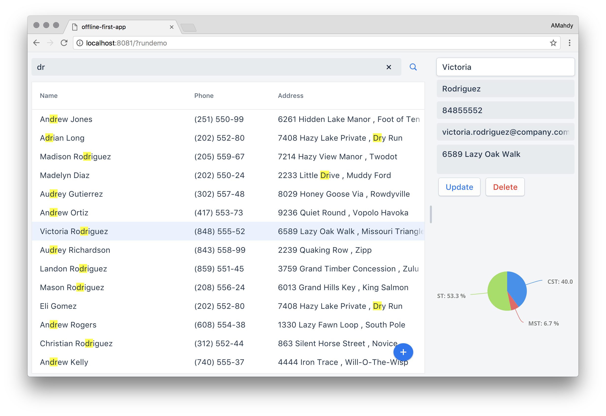

[](https://travis-ci.org/amahdy/angular-webcomponent)

# Angular App with Web Components

A concept of an app built with Angular and Web Components, with possibilities to query and manipulate data, and works totally offline.

You can try the [online demo](https://amahdy.github.io/angular-webcomponent/), and you can also [reset the local modifications](https://amahdy.github.io/angular-webcomponent/?resetdemo) at anytime.



## Step by step, building similar app

Coming soon.

## Try out this application

Make sure you have [Bower](https://bower.io) and [Angular CLI](https://www.npmjs.com/package/angular-cli) installed. Clone this project locally then:

### Installing Dependencies

Install Bower dependencies
```bash
$ bower install
```

Install Node dependencies
```bash
$ npm install
```

### Running Your Application

Start the application on port 4200
```bash
$ ng serve
```

### Viewing Your Application

The application will be available on this address by default: [http://localhost:4200](http://localhost:4200).

### Resetting Local Modiciations

Modifications done in the app are persisted in the brwoser, you can reset them using `?resetdemo`, for example: [http://localhost:4200/?resetdemo](http://localhost:4200/?resetdemo).

### Running Tests

Coming soon.